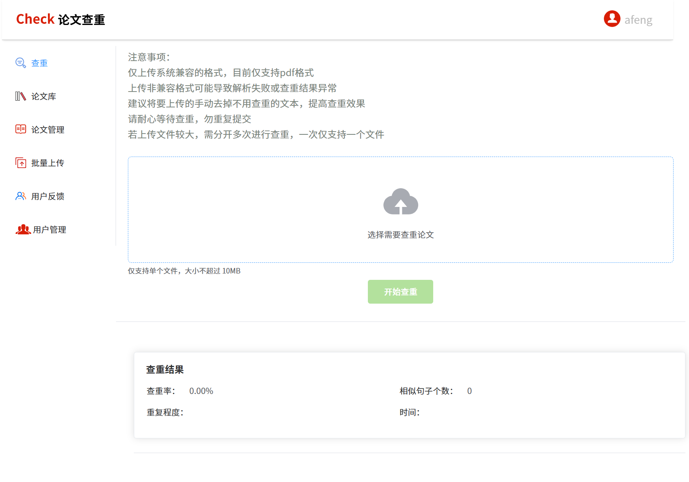
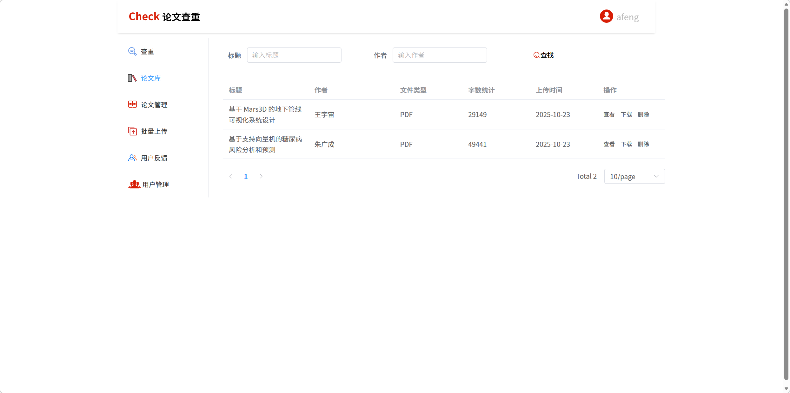
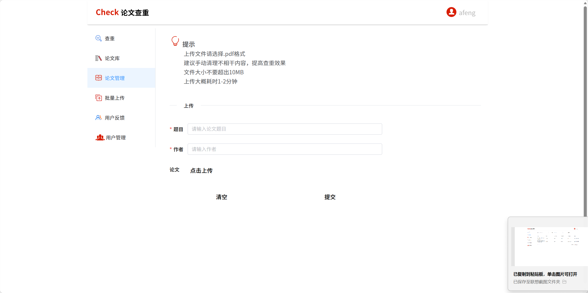
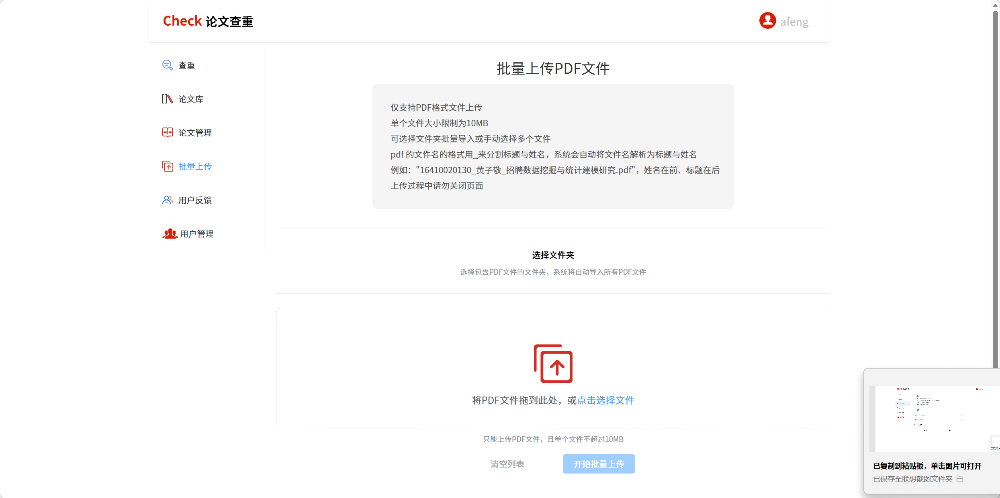
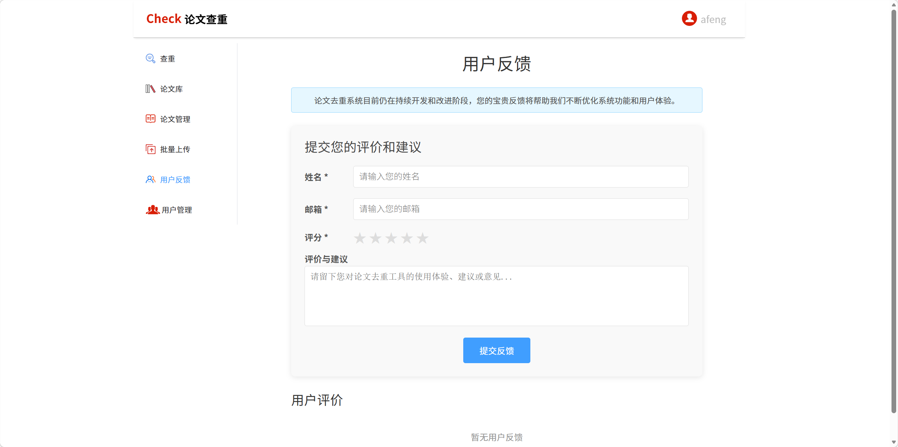
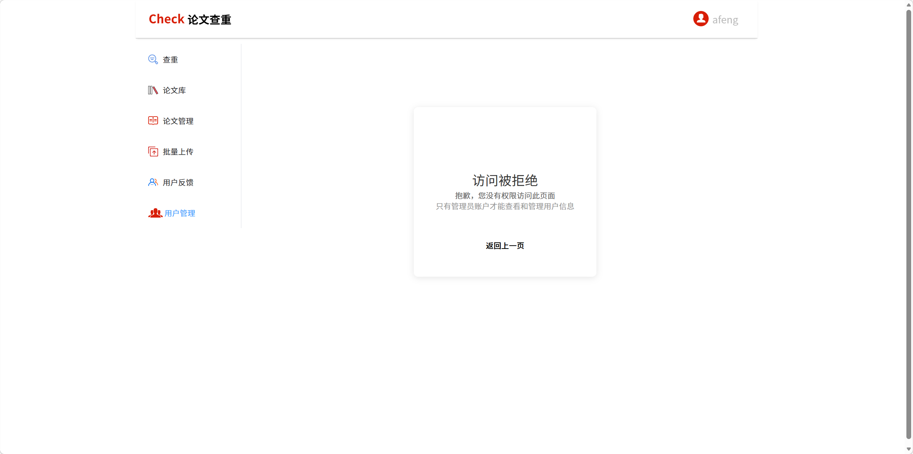
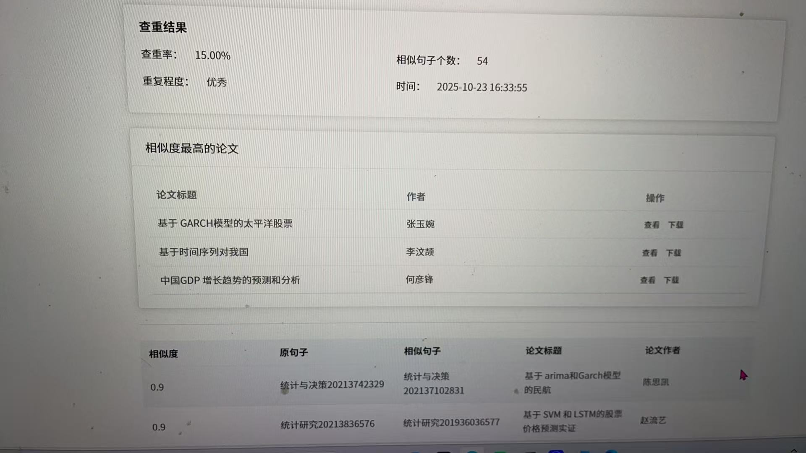

# plagChenckPro

基于 Spring Boot 3 的中文论文查重系统后端，支持论文上传、文本解析、句级查重、批量异步处理、结果追踪和用户权限管理。

## 项目简介

`plagChenckPro` 面向高校课程论文/毕业论文场景，核心流程包括：

1. 文档上传与对象存储（MinIO）
2. 文档解析（PDF/Word/TXT）
3. 分句分词与文本特征提取（HanLP + MinHash + LSH）
4. 相似句候选召回与精排（编辑距离 + 语义向量 + 关键词）
5. 输出查重率、相似句详情、疑似来源论文

## 页面截图

> 截图文件位于 `img/` 目录，以下为项目页面展示。

### 1. 系统页面 01


### 2. 系统页面 02


### 3. 系统页面 03


### 4. 系统页面 04


### 5. 系统页面 05


### 6. 系统页面 06


### 7. 系统页面 07


### 8. 系统页面 08


## 技术栈

- Spring Boot 3.0.13
- MyBatis-Plus 3.5.8
- MySQL 8
- MinIO
- Apache Tika
- HanLP
- DeepLearning4J / ND4J
- JWT
- Maven + Docker

## 核心功能

- 用户模块：登录、注册、信息修改、管理员权限控制
- 论文模块：上传、分页查询、删除、下载
- 查重模块：单篇论文查重，返回重复率和相似句
- 批量模块：多文件异步导入，任务进度/结果查询
- 反馈模块：用户反馈收集

## 查重流程

1. 使用 Apache Tika 提取文档文本
2. 文本清洗、分句、分词、停用词过滤
3. 基于 MinHash + LSH 进行候选句召回
4. 综合编辑距离、语义向量余弦、关键词重合度进行相似度评分
5. 按阈值输出相似句和重复率结果

## 项目结构

```text
src/main/java/com/afeng/plagchenckpro
├── controller      # 接口层
├── service         # 业务层
├── mapper          # 数据访问层
├── entity          # DTO/VO/POJO
├── common          # 工具类、统一返回、异常处理
├── config          # Web/异步/CORS/MinIO 配置
├── interceptor     # JWT 拦截器
└── algorithm       # MinHash / LSH 算法
```

## 本地启动

### 环境要求

- JDK 17
- Maven 3.8+
- MySQL 8.x
- MinIO

### 配置

编辑 `src/main/resources/application.properties`：

- `spring.datasource.*`：数据库配置
- `minio.*`：对象存储配置
- `server.port`：服务端口（默认 8090）

### 启动命令

```bash
mvn clean spring-boot:run
```

或：

```bash
mvn clean package
java -jar target/plagChenckPro-0.0.1-SNAPSHOT.jar
```

## 主要接口

- `POST /api/user/login`
- `POST /api/user/register`
- `POST /api/plagiarism/check`
- `POST /api/papers/upload`
- `GET /api/papers/list`
- `POST /api/batch/upload`
- `GET /api/batch/status/{taskId}`
- `GET /api/batch/result/{taskId}`

> 除登录/注册外，大部分接口需在请求头携带 `token`。

## 优势与改进

### 当前优势

- 句级查重链路完整，兼顾性能和效果
- 支持批量异步处理与任务追踪
- 模块分层清晰，便于维护与扩展

### 后续改进

- 安全性：密码哈希升级为 BCrypt，敏感配置外置化
- 工程化：补齐单元测试/集成测试与 OpenAPI 文档
- 稳定性：完善线程池隔离、重试机制和幂等控制
- 算法评估：构建标注数据集并按 Precision/Recall/F1 持续优化

## 声明

本项目用于学习与工程实践展示，不替代学校或机构的正式学术查重系统。
